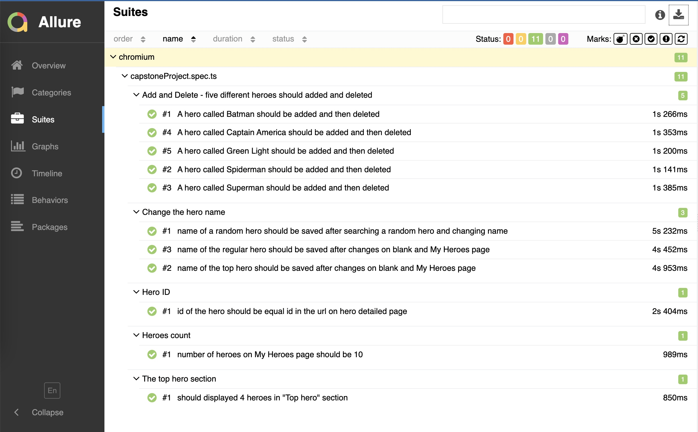

# Getting Started

Capstone Project of JavaScript for Automation testing course. There are plyawright e2e tests for super simple "Tour of Heroes" Angular app with 1 module and 2 routes.

## Get the Code
1. Clone the repo using below URL

```sh
https://github.com/sorokoletovdu/toh_ts_e2etests_capstone_project.git
```

2. Navigate to folder and install npm packages using:

```sh
npm install
```

## Development server

Run
```sh
ng serve
``` 
for a dev server. Navigate to `http://localhost:4200/`. The app will automatically reload if you change any of the source files.

## Running end-to-end tests

Run 
```sh
npx playwright test
```

to execute the end-to-end tests from the `tests` folder via [Playwright](https://playwright.dev).
Before running the tests make sure you are serving the app via `ng serve`.

## For Allure Report generation execute :

```sh
allure serve
```

## Result of test execution


